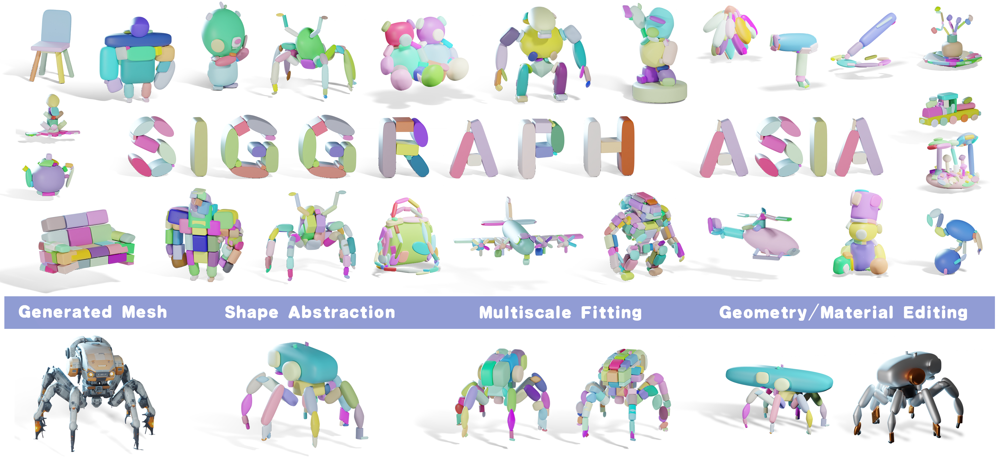

<div align="center">
<h1>Light-SQ: Structure-aware Shape Abstraction with Superquadrics for
Generated Meshes</h1>

<h4>TL;DR</h4>
<h5>We present Light-SQ, a novel superquadric-based optimization framework that explicitly emphasizes structure-awareness.</h5>

### [Project Page](https://johann.wang/Light-SQ/)



</div>

## News

[09/2025] Paper and Code coming soon!

[08/2025] Light-SQ is accepted to SIGGRAPH Asia 2025 :fire:

## Citation

If you find our work useful for your research, please consider citing our paper:
```bibtex
Coming Soon
```